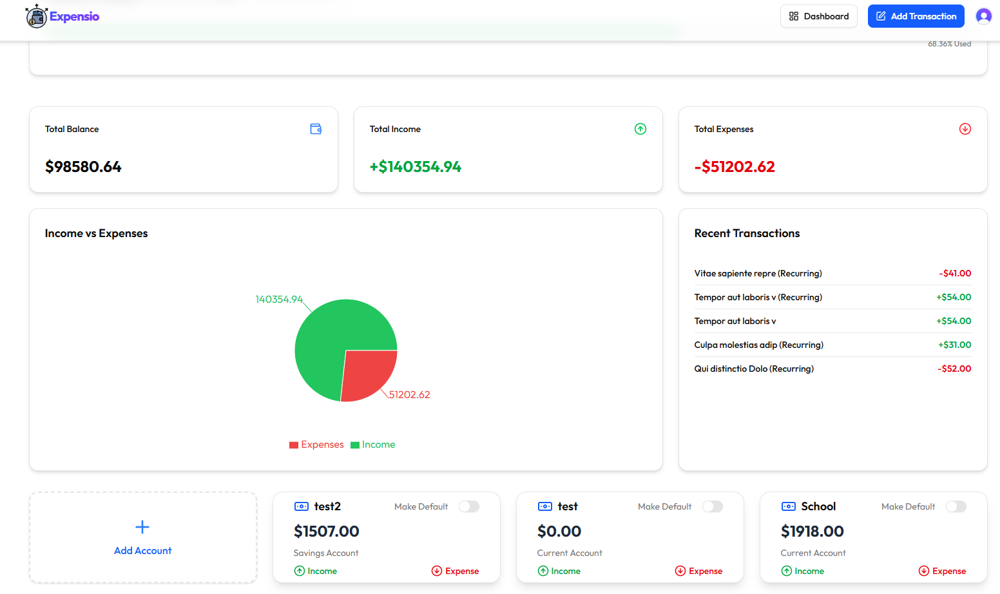
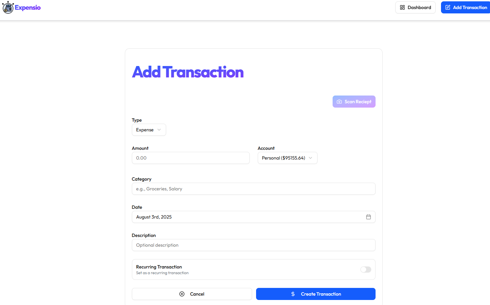
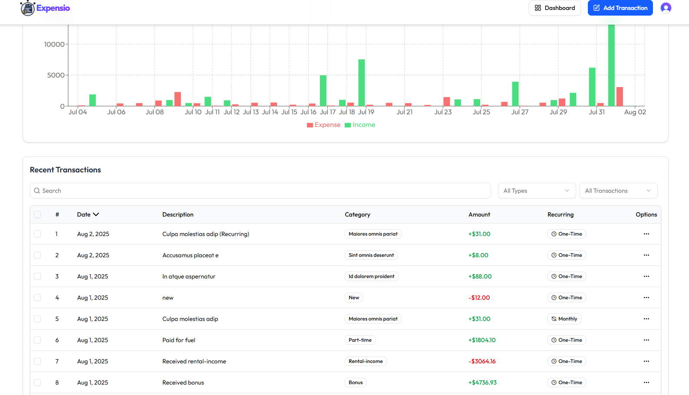

# 📊 Expensio – OneClick Budget Management Platform

Expensio is a modern and intuitive **budget management platform** designed to simplify personal and business finance tracking.Our mission is to provide users with **an effortless way to manage accounts, track expenses, set budgets, and gain a clear picture of their financial health**  all in one place.

With Expensio, you can:
- Create and manage multiple **accounts** (savings, current)
- Log **income** and **expenses** with categorized transactions
- Set and monitor **budgets** to control spending
- View,Edit and Bulk Delete **detailed transaction history** and summaries for better decision‑making
- Maintain **organized financial records** without the complexity of spreadsheets

Whether you’re an individual looking to manage daily expenses or a business wanting structured budget tracking, Expensio ensures your **financial data is always accessible, organized, and easy to understand**.

---

## 🚀 Features

- **💰 Budget Management** – Create, track, and adjust budgets in real-time.
- **📈 Dashboard Overview** – View income, expenses, and account balances at a glance.
- **📊 Visual Reports** – Pie charts and analytics for better financial understanding.
- **🔄 Recurring Transactions** – Automate regular income and expense tracking.
- **🏦 Multiple Accounts** – Manage multiple bank or manual accounts in one place.
- **🔐 Secure Authentication** – Clerk-powered login with bank-grade encryption.
- **📱 Responsive UI** – Works perfectly on mobile, tablet, and desktop.
- **↕️ Advanced Sorting & Filtering** - Sorting based on categoty, amount and date.
- **🔍 Search Functionality** - Search based on description and categoty.
- **⏳ Budget Alert Email & Recurring Transaction Cronjob (INNGEST)** - Periodic Alerts .
- **🚦 Rate Limitng (ARCJET)** - Rate Limitng implemented for preventing bot attacks.

---

## 🛠 Tech Stack

- **Frontend:** [Next.js](https://nextjs.org/), [Tailwind CSS](https://tailwindcss.com/), [ShadCN UI](https://ui.shadcn.com/), [Framer Motion](https://www.framer.com/motion/), 
- **Backend:** Next.js Server Actions, [Prisma ORM](https://www.prisma.io/)
- **Database:** [PostgreSQL](https://www.postgresql.org/), [Supabase](https://supabase.com/)
- **Authentication:** [Clerk](https://clerk.dev/)
- **Charts & Visualization:** [Recharts](https://recharts.org/en-US/)
- **Others:** [Zod](https://zod.dev/), [React-hook-form](https://www.react-hook-form.com/)

---

## 📂 Folder Structure

```bash
actions/
 ├─account.js          # Account realted actions(APIs)
 ├─budget.js           # Budget related actions(APIs)
 ├─dashboard.js        # Dashboard related actions(APIs)
 ├─seed.js             # For generating dummy transactions
 ├─send-email.js       # Email related actions (APIs)
 ├─transaction.js      # Transaction related actions (APIs)
  
app/
 ├─ (auth)             # Authentication
    ├─ Sign-in/        # Sign-in compon
    ├─ Sign-up/        # Sign-Up components 
 ├─ (root)             # Root layout components
    ├─ dashboard/      # Main dashboard
    ├─ transaction/    # Transaction CRUD
    ├─ account/        # Account CRUD
 ├─ about-us/          # About Us page
 ├─ contact-us/        # Contact Us page
 ├─ user-guide/        # User Guide page
 ├─ faqs/              # FAQs page
 ├─ support/           # Support page
 ├─ lib/               # Helper functions (Zod Validation Sch)
 └─ layout.jsx         # Main layout
components/            # Reusable UI components
lib/                   # Helper functions
prisma/                # Prisma schema & migrations
data/                  # JSON data for landing page components
hooks/                 # Custom hooks
Email/                 # Email template
public/                # Static assets (logo, icons)
middleware.js          # middlewares (protected routes)
```

---

## ⚡ Installation

### 1. **Clone the repository**
```bash
git clone https://github.com/ahmedjoseph07/expensio
cd expensio
```

### 2. **Install dependencies**
```bash
npm install
```

### 3. **Configure environment variables**
Create a `.env.local` file in the root directory and add:
```env
# Clerk Authentication
NEXT_PUBLIC_CLERK_SIGN_IN_URL=sign-in
NEXT_PUBLIC_CLERK_SIGN_UP_URL=sign-up
NEXT_PUBLIC_CLERK_PUBLISHABLE_KEY='your_secret_key'
CLERK_SECRET_KEY='your_secret_key'

# Database Connection (Supabase)
# Connection Pooling (used in production)
DATABASE_URL="postgresql://postgres.<your-db-identifier>:<your-password>@<your-region>.pooler.supabase.com:6543/postgres?pgbouncer=true"

# Direct connection (used for migrations)
DIRECT_URL="postgresql://postgres.<your-db-identifier>:<your-password>@<your-region>.pooler.supabase.com:5432/postgres"

# Email Service (Resend)
RESEND_API_KEY='your_secret_key'

# Arcjet (Rate Limiting / Security)
ARCJET_KEY='your_secret_key'

# Google Gemini API
GEMINI_API_KEY='your_secret_key'

```

### 4. **Run Prisma migrations**
```bash
npx prisma migrate dev
```

### 5. **Start the development server**
```bash
npm run dev
```
### 6. **Visit Development Server:** `http://localhost:3000`

## 🗄️Database Design (Prisma ORM)
This section describes the database structure of **Expensio** using the Prisma ORM schema definition.  
It is implemented with **Supabase** & **PostgreSQL** as the database provider.

---

### 1. **User**
- **id** *(PK)* – UUID
- clerkUserId *(Unique)* – Clerk authentication identifier
- email *(Unique)*
- name *(Optional)*
- imageUrl *(Optional)*
- transactions *(Relation → Transaction)*
- accounts *(Relation → Account)*
- budgets *(Relation → Budget)*
- createdAt *(Default: now)*
- updatedAt *(Auto-updated)*

### 2. **Account**
- **id** *(PK)* – UUID
- name
- type *(Enum: CURRENT, SAVINGS)*
- balance *(Decimal, Default: 0)*
- isDefault *(Boolean, Default: false)*
- **userId** *(FK → User.id)*
- transactions *(Relation → Transaction)*
- createdAt *(Default: now)*
- updatedAt *(Auto-updated)*

### 3. **Transaction**
- **id** *(PK)* – UUID
- type *(Enum: INCOME, EXPENSE)*
- amount *(Decimal)*
- description *(Optional)*
- date *(DateTime)*
- category *(String)*
- receiptUrl *(Optional)*
- isRecurring *(Boolean, Default: false)*
- recurringInterval *(Enum: DAILY, WEEKLY, MONTHLY, YEARLY, Optional)*
- nextRecurringDate *(Optional)*
- lastProcessed *(Optional)*
- status *(Enum: PENDING, COMPLETED, FAILED, Default: COMPLETED)*
- **userId** *(FK → User.id)*
- **accountId** *(FK → Account.id)*
- createdAt *(Default: now)*
- updatedAt *(Auto-updated)*

### 4. **Budget**
- **id** *(PK)* – UUID
- amount *(Decimal)*
- lastAlertSent *(Optional)*
- **userId** *(FK → User.id, Unique)*
- createdAt *(Default: now)*
- updatedAt *(Auto-updated)*

---

### **Relationships**
- **User → Account**: One user can have many accounts (**1:N**)
- **User → Transaction**: One user can have many transactions (**1:N**)
- **User → Budget**: One user can have only one budget (**1:1** in current schema due to `@unique`)
- **Account → Transaction**: One account can have many transactions (**1:N**)

---


## 📸 Screenshots

### Dashboard Overview


### Transactions Form


### Transactions Table


---


## 💌 Contact & Support

If you have any questions, feedback, or need assistance, feel free to reach out:  
📧 **Email:** [ahmedjoseph11@gmail.com](mailto:ahmedjoseph11@gmail.com)

